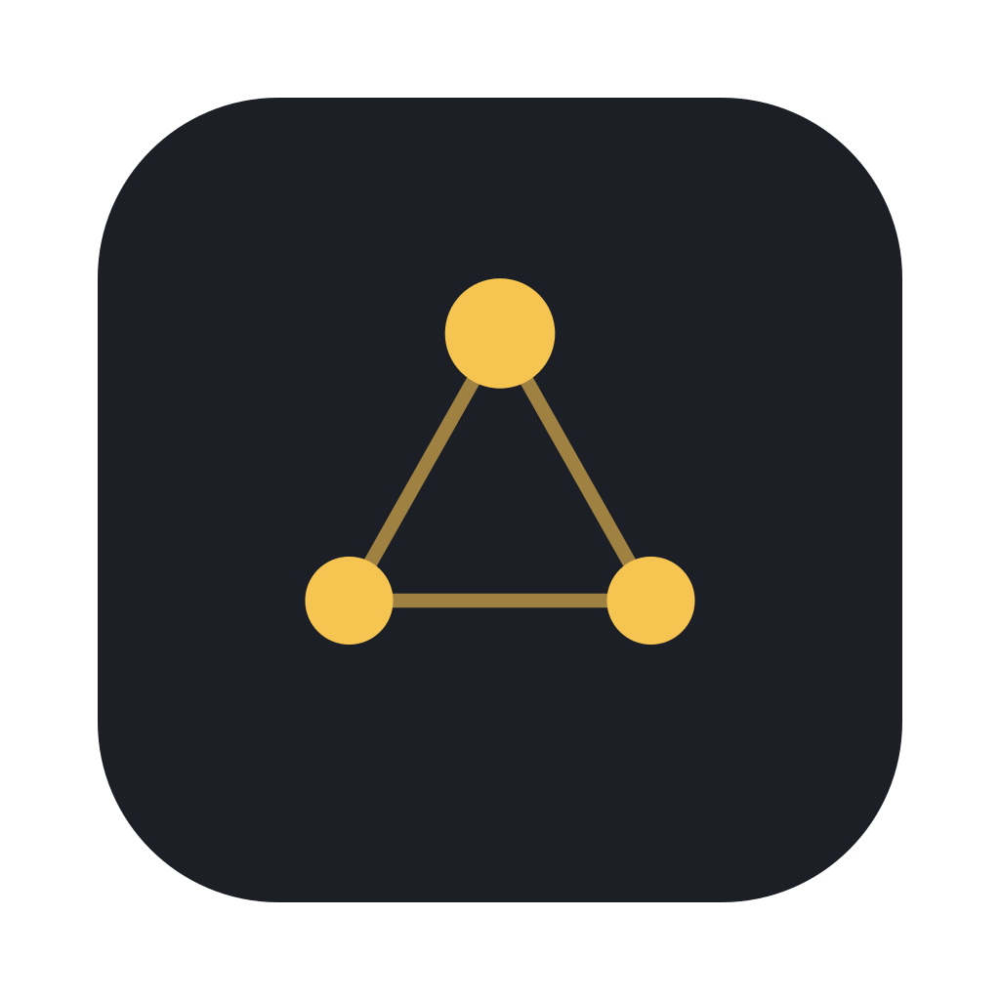
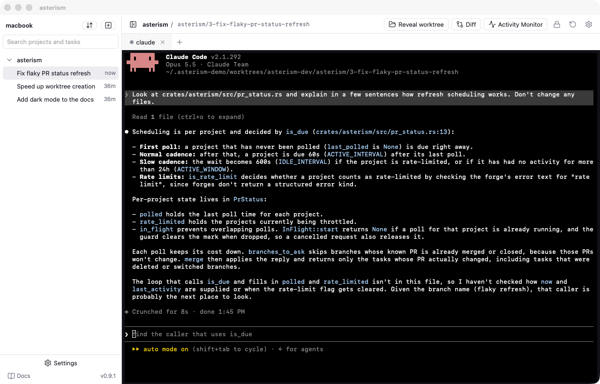

<p align="center">
  
</p>

<h1 align="center">Asterism</h1>

<p align="center">
  A macOS workspace for running coding agents — every task in its own git worktree.
  <br>
  <a href="https://asterism-dev.github.io/asterism/"><b>Documentation</b></a> ·
  <a href="https://github.com/asterism-dev/asterism/releases/latest">Download</a> ·
  <a href="https://asterism-dev.github.io/asterism/changelog/">Changelog</a>
</p>

<picture>
  <source media="(prefers-color-scheme: dark)" srcset="docs/assets/screenshots/main-dark.png">
  
</picture>

## Features

- Projects and tasks with their own branch and worktree
- Persistent agent sessions (Claude Code) and shells, run by a background daemon that survives quitting the app
- Live session status, a review pane for each task's changes and pull request status in the sidebar
- Tasks created from GitHub pull requests and issues or Linear issues
- Plugins for forges, agents and task sources, installable from stores

## Install

Download the latest DMG from [releases](https://github.com/asterism-dev/asterism/releases/latest)
(Apple silicon and Intel). The app updates itself. See the
[install guide](https://asterism-dev.github.io/asterism/guide/install/).

## Development

```sh
cd apps/desktop && npm ci && cd ../..
make dev     # run the app with a separate dev daemon
make test    # cargo + vitest
make lint
make docs    # preview the documentation
```

More in [Building from source](https://asterism-dev.github.io/asterism/developer/building/).

## License

[GPL-3.0-or-later](LICENSE)
