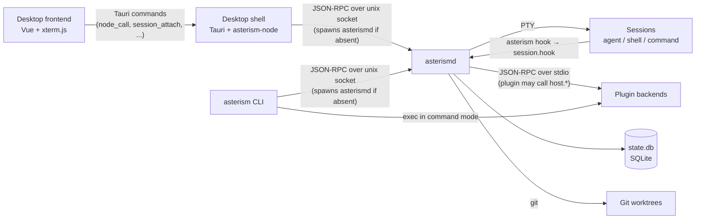

# Architecture

Asterism is split into a long-running per-user daemon, `asterismd`, and thin clients that talk to it: the desktop app and the `asterism` CLI. The daemon owns everything stateful: projects, tasks, git worktrees, terminal sessions and plugin backends. Clients only send requests and render what the daemon reports.

## Overview

- The frontend never opens the socket itself. It calls Tauri commands (`node_call`, `session_attach`, `session_detach`, `node_status`, `restart_daemon`, `quit`, `app_pid`, see `apps/desktop/src-tauri/src/main.rs`); `apps/desktop/src/api.ts` wraps them. The Rust side forwards calls to the daemon and emits `node-status` and `node-event` events back to the frontend.
- Both the app and the CLI connect to `asterismd.sock` and start `asterismd` (the binary next to their own executable) when nothing listens there. The daemon runs in its own process group, so quitting the app or closing the terminal leaves it and its sessions running.
- Sessions run in pseudo-terminals spawned by the daemon, with the task's worktree as working directory. Agents can report status through `asterism hook <event>`, which reads `ASTERISM_SESSION` from its environment and calls `session.hook`.
- Plugin backends are child processes of the daemon that speak JSON-RPC over stdin/stdout. Commands a plugin contributes to the CLI are the exception: `asterism <command>` replaces itself with the plugin backend in command mode, without going through the daemon. See [Writing plugins](writing-plugins.md).

## Crates

The Cargo workspace (`Cargo.toml`) has five members. `apps/desktop/src-tauri` is excluded from the default members because it needs the built frontend and sidecars; build it through npm (see [Building from source](building.md)).

### `asterism-proto`

The wire protocol shared by every other crate:

- `rpc.rs`: JSON-RPC 2.0 `Request`, `Response`, `Notification` and `RpcError`. Every error carries a machine-readable `data.kind` (`not_found`, `git`, `plugin_error`, `needs_setup`, ...) next to its numeric code.
- `types.rs`: all method names (the `method` module) and their parameter and result types, plus the `Event` notifications the daemon pushes to subscribed clients.
- `client.rs`: an async client over a unix stream that matches responses to requests and hands out notifications as an event stream.
- `paths.rs`: the layout of `ASTERISM_HOME` (see [Where state lives](#where-state-lives)).
- `PROTO_VERSION` (currently 2) and `BUILD_ID`. Clients send `PROTO_VERSION` in `hello`; `BUILD_ID` is `git describe --always --dirty` at build time, used to tell two builds of the same version apart.

Messages are newline-delimited JSON, one message per line.

### `asterism` (library `asterism_core`)

The daemon, the CLI and the built-in plugin backends:

| Path | Role |
|---|---|
| `src/bin/asterismd.rs` | Daemon entry point; calls `asterism_core::run`. |
| `src/bin/asterism/` | The `asterism` CLI. |
| `src/bin/asterism-plugin-{claude,github,linear}/` | Backends of the built-in plugins. |
| `src/lib.rs` | `run`: takes `asterismd.lock`, binds the socket, recovers sessions, starts the store refresh and pull request polling loops. |
| `src/rpc.rs` | Socket server: one task per request, session output forwarding, and the host API exposed to plugins. |
| `src/daemon.rs` | `Daemon`: projects, tasks, sessions, plugins, stores and pull request status. |
| `src/session.rs` | `Pty`: a pseudo-terminal (`portable-pty`) with a `vt100` screen model for reads and attach snapshots. |
| `src/status.rs` | Session status tracking (see [Session lifecycle](#session-lifecycle)). |
| `src/store.rs` | SQLite store for projects, tasks and sessions, with schema migrations tracked in `PRAGMA user_version`. |
| `src/pr_status.rs` | Pull request polling: every 60 s for tasks active in the last day, every 10 min otherwise or when rate limited. |
| `src/plugins/` | Plugin manifests, discovery, backend processes, settings, stores and installs. |
| `plugins/*/plugin.toml` | Manifests of the built-in plugins, compiled into the daemon. |

### `asterism-plugin`

The library plugin backends written in Rust build on: `protocol.rs` defines the daemon-to-plugin methods and their types (`PROTOCOL = 1`), and `serve` runs a request loop on stdin/stdout, handing each request to a handler together with a `Host` that can call back into the daemon. The built-in backends use it; a plugin in another language implements the same protocol directly.

### `asterism-node`

The desktop app's connection to its local daemon. `LocalNode` connects to the socket, starts the bundled `asterismd` if needed, sends `hello` and `subscribe`, reconnects with backoff, and reports its state (`connecting`, `connected`, `update_available`, `incompatible`, `disconnected`). When the app starts the daemon, it first reads `PATH` from the user's login shell, because apps launched from the Finder only get a minimal one.

If the running daemon is older than the bundled one (or the same version from a different build), the app restarts it silently once, but only when no session is running; otherwise it reports `update_available`.

### `apps/desktop`

A Tauri 2 app with a Vue 3 frontend. `scripts/prepare-sidecars.mjs` builds the `asterism` crate's binaries (`asterismd`, `asterism`, `asterism-plugin-claude`, `asterism-plugin-github`, `asterism-plugin-linear`) and copies them to `src-tauri/binaries/` with the target triple as suffix, which is where Tauri's `externalBin` expects them. In the bundle they sit next to the app executable, so the daemon finds both the CLI and the built-in plugin backends in its own directory.

## Session lifecycle

1. **Task creation** (`task.create`) creates a branch and a git worktree under the worktrees directory, grouped as `<owner>/<repo>/<branch>` from the project's `origin` remote.
2. **Session start** (`session.start`) has three kinds: `agent`, `shell` (`$SHELL`, falling back to `/bin/sh`) and `command` (an explicit argv). For an agent, the argv comes from its plugin: either the manifest's static templates or the backend's `agent.prepare` reply. The process runs in a PTY in the task's worktree. Its environment is the daemon's, minus `CLAUDE*` and `ANTHROPIC_*` unless the agent's environment settings add them back, plus `PATH` (the daemon's directory first), `ASTERISM_HOME`, `ASTERISM_SOCKET`, `ASTERISM_CLI`, `ASTERISM_TASK` and `ASTERISM_SESSION`.
3. **Status tracking.** A session is `working` while it produces output. After 2 s of silence it becomes `waiting_input` if the screen contains one of the agent's `waiting_patterns`, otherwise `idle`. Once an agent has reported through `session.hook`, hook events drive the status instead: `prompt-submit` and `tool` mean `working`, `notification` means `waiting_input`, and silence only ends `working`. A hook may also store the agent's own session id (`agent_ref`).
4. **Exit.** When the process exits, the session becomes `exited`. Archiving a task kills its sessions.
5. **Daemon restart.** On startup the daemon walks all sessions that were not `exited`. Agent sessions of non-archived tasks are resumed when the agent supports resuming and an `agent_ref` was recorded; every other session is marked `exited`.

Clients that call `subscribe` receive change notifications (`session.status_changed`, `session.changed`, `task.changed`, `plugins.changed`, `pr.changed`, ...). `session.attach` returns a screen snapshot and then streams the session's output as base64 `session.output` notifications.

## Where state lives

Everything lives under `ASTERISM_HOME`, which defaults to `~/.asterism`. The directory is created with mode `0700`, because the socket grants full control over the user's sessions.

| Path | Content |
|---|---|
| `asterismd.sock` | The daemon's unix socket. |
| `asterismd.lock` | Held by the running daemon so that two daemons never run against the same home. |
| `asterismd.log` | The daemon's stderr, including plugin backend stderr prefixed with `plugin <name>:`. |
| `state.db` | SQLite database with projects, tasks and sessions. |
| `config.toml` | Settings: paths, agent settings, non-secret plugin settings, default forge. |
| `secrets.toml` | Secret plugin settings, written with mode `0600`. |
| `worktrees/` | Default worktrees directory; configurable in the node settings. |
| `repos/` | Default directory for cloned and created repositories; configurable in the node settings. |
| `agents/<agent>/` | Per-agent `mcp.json` and `hooks.json`. |
| `plugins/links.toml` | Plugins linked from a local directory. |
| `plugins/stores.toml`, `plugins/stores/` | Configured plugin stores and their git checkouts. |
| `plugins/installed.toml`, `plugins/installed/<name>/<version>/` | Installed store plugins. |
| `plugins/data/<name>/` | Each plugin's private data directory. |
| `plugins/cache/git/` | Git checkouts of plugin sources. |

Setting `ASTERISM_HOME` gives a fully separate instance with its own daemon; `make dev` uses this to run a development build next to the installed app.
